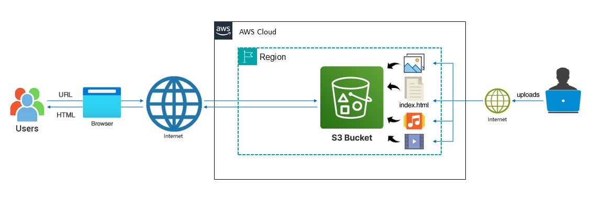

# ☁️ Static Website Hosting using Amazon S3

## 📌 Project Overview

This project demonstrates static website hosting using Amazon S3 without provisioning any compute resources.  
The website is served directly through the S3 Website Endpoint, showcasing a serverless hosting model for static content.

---

## 🏗 Architecture Flow

Client → S3 Website Endpoint → `index.html`

- Amazon S3 hosts static website files using Static Website Hosting  
- Bucket policy enables public read access  
- Content is served via the S3 website endpoint (HTTP)  

---

## ⚙️ Implementation Summary

### Bucket Provisioning
- Created a globally unique S3 bucket  
- Selected AWS region  
- Configured public access settings  

### Static Website Configuration
- Enabled Static Website Hosting  
- Set `index.html` as the index document  
- Retrieved S3 website endpoint  

### Access Control
- Applied bucket policy allowing `s3:GetObject`  
- Verified public read access  

### Deployment
- Uploaded static website file  
- Validated object accessibility  
- Tested website via S3 endpoint  

---

## 🛠 Implementation Steps

1. Created S3 bucket  
2. Enabled Static Website Hosting  
3. Configured index document as `index.html`  
4. Modified public access settings  
5. Applied bucket policy for public read access  
6. Uploaded static website file  
7. Verified deployment via endpoint URL  

---

## 🔐 Security Considerations

- Public access is enabled for content delivery (not suitable for sensitive data)  
- No IAM credentials exposed  
- No compute infrastructure involved  
- Reduced operational overhead compared to server-based hosting  

---

## 🚀 Key Outcome

- Fully serverless hosting model  
- Eliminated server management overhead using S3  
- Automatic high availability  
- Cost-efficient static content delivery  

---

## 📂 Repository Files

- `index.html` – Contains complete static website (HTML, CSS, JavaScript)  
- `README.md` – Project documentation  
- `s3-architecture.jpg` – Architecture diagram  
- `Snapshots - 2.pdf` – Project snapshots  

---

## 📸 Snapshots include:

- Live Website Output via S3 Endpoint  
- S3 Bucket Overview  
- Static Website Hosting Configuration  
- Bucket Policy Configuration

---
